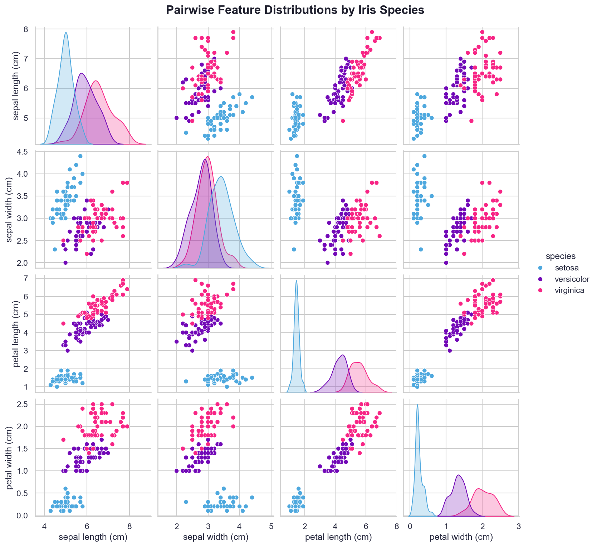
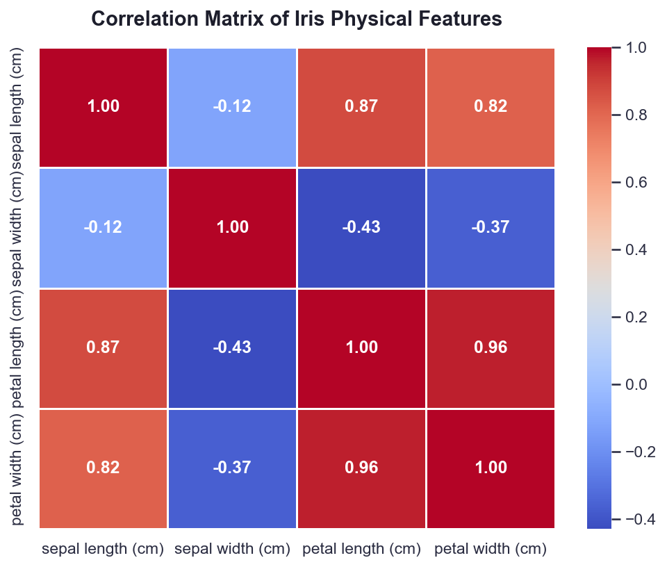
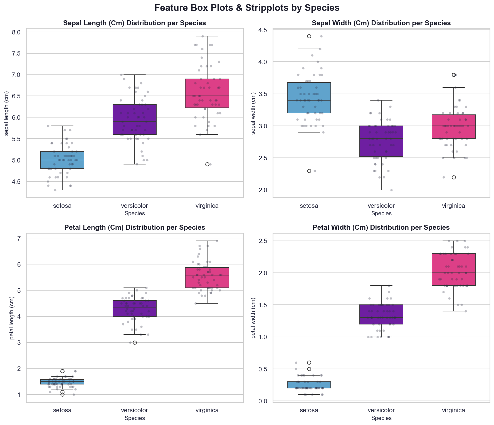
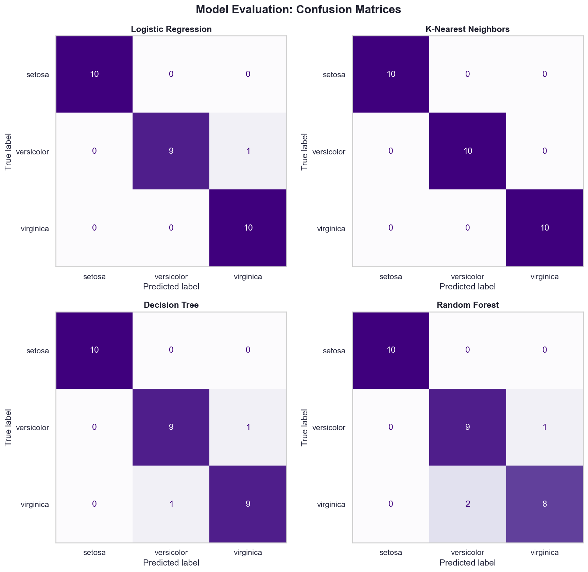

# Car Price Prediction using Machine Learning

## Objective
Predict the selling price of a used car using machine learning.

## Technologies
- Python
- Pandas
- NumPy
- Matplotlib
- Seaborn
- Scikit-learn

## Models
- Linear Regression
- Random Forest Regressor
- Gradient Boosting Regressor

## Evaluation Metrics
- MAE
- RMSE
- R� Score

## Dataset
Vehicle Dataset from CarDekho (Kaggle)

## Screenshots

Below are example visualizations. Images are linked from the existing Iris project screenshots in the workspace — replace these with your own Car Price screenshots if preferred.

- 
- 
- 
- 

If you want me to copy these images into `screenshots/` inside this project, say so and I'll duplicate them here.
