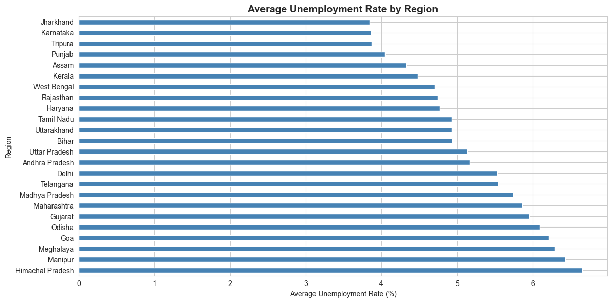
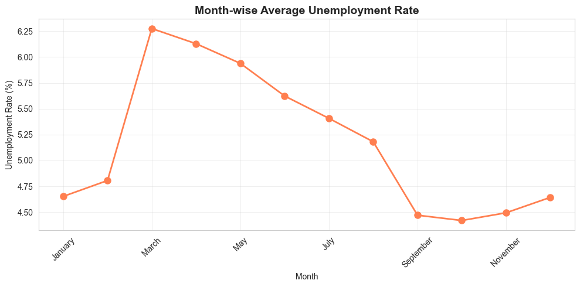
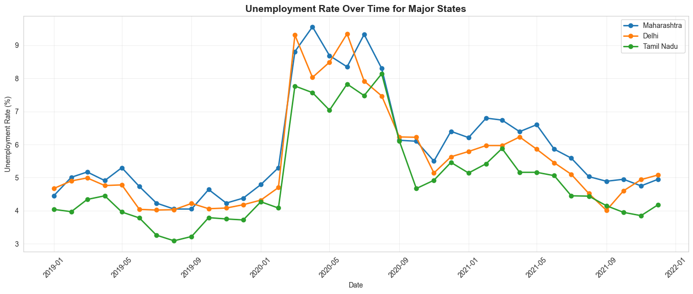
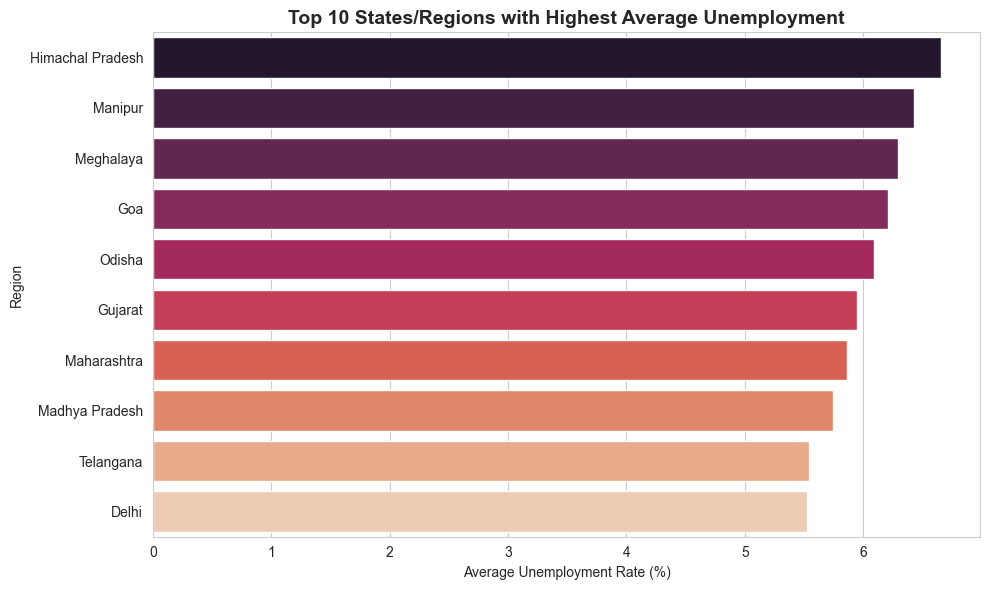
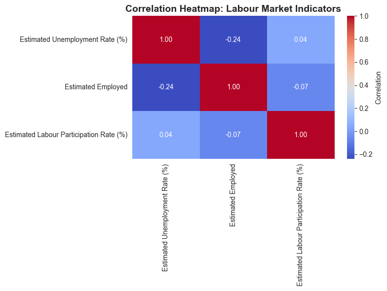
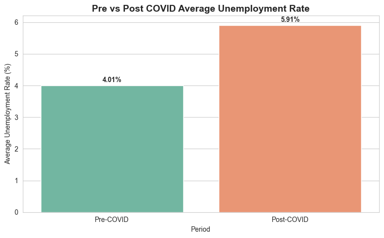

# Unemployment Analysis with Python

## Objective
Analyze unemployment trends in India using Python and visualize key insights using data analysis techniques.

## Technologies Used
- Python
- Pandas
- NumPy
- Matplotlib
- Seaborn

## Dataset
Unemployment in India Dataset

## Features
- Data Cleaning
- Exploratory Data Analysis (EDA)
- Unemployment Trend Analysis
- State-wise Analysis
- COVID-19 Impact Analysis
- Data Visualization

## Screenshots

### Region-wise Unemployment

### Month-wise Trend

### Time Series Analysis

### Top 10 States

### Correlation Heatmap

### Pre vs Post COVID Analysis

## Author

**Diljeet Sajnani**